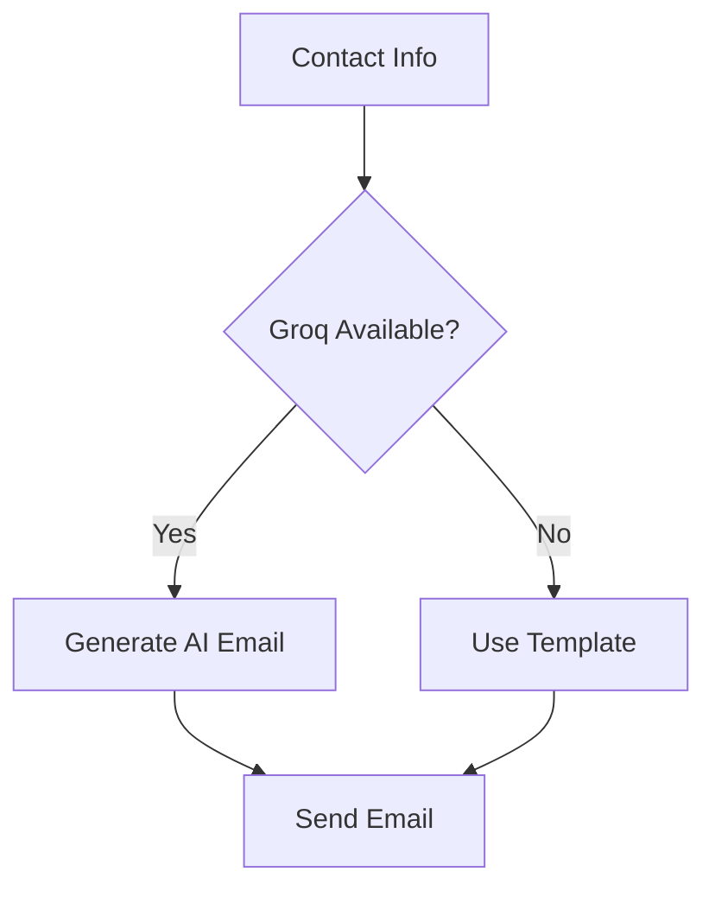

# Contact Scraper & Outreach System

An intelligent tool for finding and contacting professionals in real estate, banking, and mixed niches with AI-powered personalization.

## Overview

This system:
1. Discovers contacts by professional category (real estate, banking, mixed niches)
2. Extracts professional information including:
   - Names and titles
   - Email addresses
   - Phone numbers
   - Source URLs
3. Generates personalized emails using AI (Groq integration)
4. Tracks outreach with daily limits (450/day default)

## Key Features

- 🏠 Real Estate Professionals: 24+ roles including Realtors, Investors, Mortgage Brokers
- 💼 Banking/Finance: 23+ roles including Wealth Managers, Financial Advisors, Bankers
- 🚀 Mixed Niches: 23+ roles including Entrepreneurs, Influencers, Coaches
- 🤖 AI-Powered: Dynamic email generation using Groq API
- 🔍 Smart Scraping: Context-aware contact extraction
- ⏱️ Rate Limited: 450 emails/day default with configurable delays
- 📊 Tracking: Detailed CSV logging of all outreach
- 📎 Attachments: Support for file attachments (resumes, brochures)

## Installation & Setup

### 1. Clone Repository
```bash
git clone [repository_url]
cd contact-scraper
```

### 2. Install Dependencies
```bash
pip install -r requirements.txt
```

### 3. Configuration
Edit `config.py` with your details:
```python
# Email Configuration (Required)
SENDER_EMAIL = "your_email@example.com"  # Your Gmail address
SENDER_PASSWORD = "your_app_password"    # Gmail App Password

# Groq API (Optional for AI emails)
GROQ_API_KEY = "your_groq_api_key"       # Get from Groq console
GROQ_MODEL = "mixtral-8x7b-32768"       # Default AI model

# Email Limits
DAILY_EMAIL_LIMIT = 450                  # Max emails per day
```

### 4. First Run Setup
```bash
python main.py
```
This will create the data directory and contacts CSV file.

## Usage Guide

### Finding Contacts
```bash
python main.py
```
- Scrapes contacts based on configured target roles
- Stores results in `data/contacts.csv`
- Automatically avoids duplicates

### Sending Emails
```bash
python email_sender.py --attachment resume.pdf --delay 10
```
Options:
- `--attachment`: File to attach (PDF recommended)
- `--delay`: Seconds between emails (default: 5)
- `--limit`: Max emails to send (default: daily limit)
- `--test`: Preview emails without sending

### Email Templates
1. Create/edit `email_template.txt`:
```
Hi [Name],

I noticed your work as a [Role] and wanted to connect...

Best regards,
[Your Name]
```
2. Placeholders: `[Name]`, `[Role]` auto-filled

### Monitoring Progress
- Check `data/contacts.csv` for:
  - `mail_sent` date (if email was sent)
  - Source URLs
  - Contact details

## Target Roles Configuration
Edit `DOMAIN_KEYWORDS` in `config.py` to modify:
- Real Estate: Realtors, Investors, Brokers (24 roles)
- Banking: Wealth Managers, Advisors, Bankers (23 roles)  
- Mixed Niches: Entrepreneurs, Coaches, Creators (23 roles)

## Technical Details

### Search Process
1. Uses Google search with professional role keywords
2. Scrapes resulting pages for contact info
3. Contextually extracts names and titles near emails

### Email Generation


### Data Flow
1. Contacts saved to CSV with metadata
2. Email status updated after sending
3. Daily counters prevent over-sending

## Project Structure

- `main.py` - Main entry point for the application
- `config.py` - Configuration settings including search keywords
- `email_sender.py` - Tool for sending personalized emails to contacts
- `email_template.txt` - Sample template for outreach emails
- `scraper/`
  - `search_engine.py` - Handles web searches
  - `email_scraper.py` - Extracts contacts from web pages
  - `utils.py` - Helper functions
- `data/` - Where extracted contacts are stored

## Troubleshooting

### Common Issues
1. **Emails not sending**:
   - Verify Gmail App Password is correct
   - Check SMTP settings in config.py
   - Try test mode: `python email_sender.py --test`

2. **No contacts found**:
   - Check internet connection
   - Verify keywords in config.py
   - Try reducing search delay in search_engine.py

3. **AI emails not working**:
   - Ensure Groq API key is valid
   - Check Groq service status
   - Fall back to template mode if needed

## Roadmap
- LinkedIn integration
- Enhanced company detection  
- Email open tracking
- Dashboard for analytics

## Legal Notice

This tool is for educational purposes only. Always respect website terms of service and privacy policies when scraping content. Use responsibly and ethically.

When sending emails, ensure you comply with anti-spam laws such as CAN-SPAM, GDPR, and CASL. Always provide an unsubscribe option and your physical address.

## License

MIT License
